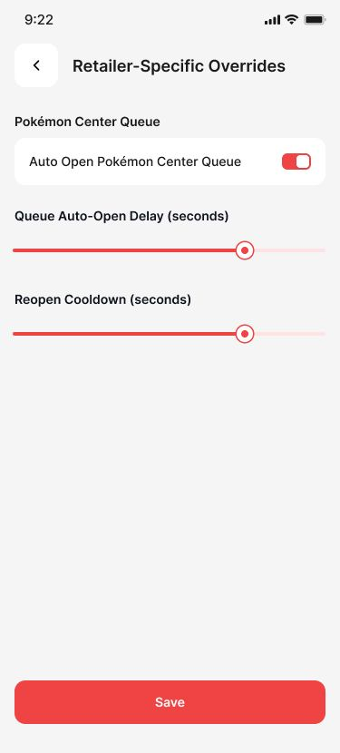

# RestockR Developer Handoff

RestockR is a cross–platform Flutter client for monitoring high–demand product restocks, managing personal watchlists, and collaborating on inventory signals. Front‑end implementation is feature complete; the next phase is to connect it to the production backend, harden the deployment pipeline, and ship a 1.0 release. This README captures everything the incoming team needs to continue confidently.

> **Branch notice (`v0.1`)**  
> This branch is a developer-focused staging ground for new navigation work, auth wiring, and tooling tweaks. Expect rapid iteration, force-pushed fixes, and occasional breaking changes while features burn in. Reach for `main` when you need the latest semi-stable build.

---

## Collaboration TL;DR
- **Current status**: Flutter UI, navigation flows, and local state layers are ready. Backend service calls are mocked and must be wired to the real API. No production build has been cut yet.
- **Primary tools**: `./start.sh` (interactive launcher), `./install.sh`, `./envsetup.sh`, `./emulators.sh`, and `./logs.sh` orchestrate setup, diagnostics, and daily workflows.
- **Secrets**: `env.json` (generated automatically) holds API keys. It is `.gitignore`d and locked to permission `600`.
- **Testing**: No automated test suite beyond `flutter test` scaffolding. Plan to add integration tests alongside backend hookup.
- **Next major deliverables**:
  1. Finalize backend endpoints and SDK integration.
  2. Implement authentication + session persistence.
  3. Stand up staging/production build targets and CI.
  4. Run accessibility, performance, and store–readiness reviews.

---

## Project Snapshot

| Area | Notes |
| --- | --- |
| **Product Vision** | Give collectors/operators a command center to track restocks across multiple retailers with actionable alerts and historical insights. |
| **Platforms** | iOS, Android, Web (single Flutter codebase). |
| **State Management** | `flutter_riverpod` with `StateNotifier` view models, `equatable` data classes. |
| **Networking** | Placeholder services; awaiting final backend contract (Supabase + LLM helpers referenced in `env.json`). |
| **Design System** | Custom widgets under `lib/widgets`, responsive utilities in `lib/core/utils`. |
| **Logging** | All CLI tooling streams to `.restockr_logs/session_<timestamp>.log[.gz]` for traceability. |

---

## Product Experience Gallery

### Developer Quick Launch Walkthrough
1. **Run the launcher (`RunStartScript.png`)**  
   Execute `./start.sh` from the project root. The script validates the environment (Flutter/Dart/git, CocoaPods on macOS), ensures `env.json` exists, and offers guided fixes. It will not install global dependencies without your confirmation; watch for yellow prompts asking before running Homebrew/apt/snap commands. When the summary banner shows no blocking warnings, you are ready for launch.
   
2. **Choose “Quick Launch” (`QuickLaunch.png`)**  
   Option `[1] Quick Launch` performs the fastest path to running RestockR. It checks for connected devices, surfaces recommended targets (iOS/Android/Chrome), and queues the proper `flutter run` command. Selecting other menu items keeps you in the launcher for advanced actions.
   
3. **Select the iOS simulator (`iOSEmu.png`)**  
   When prompted for a platform, pick iOS if you want to boot Apple silicon simulators. The launcher queries available runtimes and uses `simctl` to pick an appropriate device. If none exist, it will offer to create one.
   
4. **Watch the simulator boot (`LaunchiOSSimulation.png`)**  
   The script opens Simulator.app and attaches a spinner while `simctl` boots the selected device. Expect a short delay the first time as Xcode initializes assets.
   
5. **Confirm RestockR is live (`AppLaunchedSuccessfully.png`)**  
   Once the device registers with `flutter devices`, the launcher deploys the app. You should see the Flutter build banner followed by RestockR’s splash screen inside the simulator.
   

### Core Application Screens
- **Splash Screen (`SplashScreen.jpg`)**  
  Animated intro that sets the brand tone while Flutter finalizes initialization.
  
- **Login Screen (`Login.jpg`)**  
  Credential form with inline validation, password visibility toggle, and quick navigation to recovery actions.
  
- **Monitor Feed (`Monitor.jpg`)**  
  Real-time restock cards exposing retailer, quantity, pricing, and sentiment actions (up/down votes, buy buttons).
  
- **Watchlist Overview (`Watchlist.jpg`)**  
  Active subscriptions with SKU detail preview and instant unsubscribe control.
  
- **Discovery Watchlist (`Watchlist_2.jpg`)**  
  Explore new products and subscribe with one tap to extend coverage.
  
- **Number-Type Filter (`FilterNumberType.jpg`)**  
  Tune thresholds for stock levels or velocity metrics to minimize noise.
  
- **Product-Type Filter (`FilterProductType.jpg`)**  
  Focus on categories (consoles, cards, etc.) aligned with operator responsibilities.
  
- **Retailer Filter (`FilterRetailer.jpg`)**  
  Zero in on specific merchants or marketplace groups for targeted monitoring.
  
- **Retailer Overrides (`RetailerSpecificOverrides.jpg`)**  
  Configure per-retailer delays, cooldowns, and notification rules to respect store quirks.
  
- **Global Filtering (`GlobalFiltering.jpg`)**  
  Set account-wide minimum quantities and auto-open rules to match restock goals.
  
- **History Timeline (`History v2.jpg`)**  
  Heatmap of restock activity by hour for postmortems and scheduling.
  
- **Notifications & Alerts (`NotificationsAlerts.jpg`)**  
  Toggle restock sounds, push notifications, and escalation preferences.
  
- **Profile Hub (`Profile_1.jpg`)**  
  Entry point to alert preferences, account settings, and integrations.
  
- **Profile Utilities (`Profile_2.jpg`)**  
  Placeholder for upcoming backend-linked features (e.g., organization switching, device management).
  

---

## Codebase Tour

```
.
├── android/                     # Standard Flutter Android project
├── ios/                         # iOS/Xcode project + Pod configuration
├── lib/
│   ├── core/                    # App-wide exports, routing, sizing utilities
│   ├── presentation/            # Feature-first screens with models/notifiers/widgets
│   ├── routes/                  # Route generator & navigation configuration
│   ├── theme/                   # ThemeData, color palettes, typography
│   └── widgets/                 # Reusable UI components
├── assets/                      # Images, fonts, mock data
├── scripts (root)               # Executable helpers (start/install/envsetup/etc.)
├── pubspec.yaml                 # Dependencies, fonts, assets
└── env.json                     # Generated secrets (ignored from VCS)
```

Key entry points:
- `lib/presentation/*_screen/` packages UI + `StateNotifier` logic per feature.
- `lib/core/app_export.dart` aggregates shared imports to keep feature files lean.
- `lib/core/utils/size_utils.dart` drives scalable spacing and typography.
- `lib/widgets/` contains custom buttons, text fields, app bars, etc.

---

## Tooling & Scripts

| Script | Purpose |
| --- | --- |
| `start.sh` | Main launcher. Runs diagnostics, guides device/emulator selection, launches the app, and records session logs. |
| `envsetup.sh` | Validates project structure, ensures `env.json`, checks toolchains (Flutter, Dart, git, CocoaPods), and offers guided fixes. |
| `install.sh` | Clean install or reinstall workflow (`flutter pub get`, pod install, workspace cleanup). |
| `emulators.sh` | Interactive manager for iOS simulators & Android emulators, including auto-creation and boot helpers. |
| `uninstall.sh` | Removes generated artifacts, pods, build outputs, and the `.restockr_devkit` marker. |
| `logs.sh` | Inspect, export, or prune `.restockr_logs`. Keeps only the most recent 50 logs (compresses older entries). |
| `test_start.sh` | Smoke test that the launcher boots and logs correctly. Useful in CI once added. |

> All scripts source common helpers from `lib/common.sh` and `lib/visual.sh`, which provide logging, colored output, spinners, timers, and shared environment variables.

---

## Environment Setup

1. **Install prerequisites**
   - Flutter SDK `^3.6.0` (check with `flutter --version`).
   - Dart (bundled with Flutter).
   - Xcode + command-line tools (macOS/iOS) and Android Studio/SDK (Android).
   - Homebrew (macOS) is optional but unlocks automated fixes in the scripts.

2. **Clone the repository**
   ```bash
   git clone https://github.com/LucasQuiles/RestockR.git
   cd RestockR
   ```

3. **Bootstrap tooling**
   ```bash
   chmod +x start.sh install.sh envsetup.sh emulators.sh logs.sh uninstall.sh
   ./start.sh
   ```
   - First run prompts for installation → runs `envsetup.sh` checks → executes `flutter pub get` → optionally installs CocoaPods.
   - Subsequent runs drop you in the developer menu with quick actions (launch app, run tests/analyzer, manage emulators, reinstall kit).

4. **Configure `env.json`**
   - Generated automatically if missing. Populate with real values before hitting production services:
     ```json
     {
       "SUPABASE_URL": "https://your-supabase-project.supabase.co",
       "SUPABASE_ANON_KEY": "replace-me",
       "OPENAI_API_KEY": "replace-me",
       "GEMINI_API_KEY": "replace-me",
       "ANTHROPIC_API_KEY": "replace-me",
       "PERPLEXITY_API_KEY": "replace-me"
     }
     ```
   - File permissions are locked to `600` by the setup script; avoid loosening them.

---

## Running, Building, and Testing

### Day-to-day development
```bash
./start.sh          # recommended workflow (device detection + launch)
flutter run         # manual launch if you already have a device/emulator up
```

### Static analysis & unit tests
```bash
flutter analyze
flutter test
```
> No tests exist yet—plan to introduce unit tests for Riverpod notifiers and widget tests for the critical flows once backend integration lands.

### Release builds
```bash
flutter build apk --release
flutter build ios --release
flutter build web --release
```
Make sure to configure signing, provisioning profiles, and store metadata during the release hardening sprint.

---

## Backend & Integration Expectations

- **Current state**: All API calls are placeholders. Mock data is currently embedded or sourced from assets; there is no live networking layer.
- **Target stack**: Supabase is referenced for storage/auth (see `env.json`). Large-language-model keys (OpenAI, Gemini, Anthropic, Perplexity) are reserved for assistant features planned in later phases.
- **Next steps**:
  1. Finalize API contract (payload shapes, auth flows, error handling).
  2. Implement a dedicated data layer (e.g., `lib/data/`) with repositories/services using `dio` or `http` (not yet added to `pubspec.yaml`).
  3. Replace dummy providers with asynchronous data sources and handle loading/error states in each feature screen.
  4. Persist sessions/token refresh using `shared_preferences` (already included).
  5. Add offline caching strategy if required by operators (to be scoped).

Document the final REST/gRPC/WebSocket interface inside the repo once complete (consider `docs/` or a Wiki entry).

---

## Development Workflow & Collaboration

- **Branching**: Use feature branches (`feature/backend-auth`, `fix/login-validation`, etc.) off `main`. Keep `main` deployable.
- **Commits**: Conventional style (`feat:`, `fix:`, `chore:`) is preferred to align with existing history.
- **Code Reviews**: Submit PRs against `main`. Include screenshots/GIFs for UI changes and describe testing performed.
- **CI/CD**: Not yet configured. Recommendation: set up GitHub Actions with stages for `flutter analyze`, `flutter test`, and `./test_start.sh`.
- **Release cadence**: Pending. Suggest establishing `staging` and `production` branches once backend integration stabilizes.
- **Documentation**: Additional design docs auto-generated during the refactor were intentionally removed from git. If you regenerate collaboration notes, store them in a shared drive or a new `docs/` folder that remains ignored if the volume is high.

---

## Observability & Troubleshooting

- Session logs live in `.restockr_logs/`. New entries are created every time a script runs.
- `logs.sh` offers `list`, `view`, `export`, and `prune` commands:
  ```bash
  ./logs.sh list
  ./logs.sh view latest
  ./logs.sh export ios-launch > ios_setup.txt
  ```
- iOS specific tips:
  - Ensure Xcode is fully installed (`xcode-select -p` should not error).
  - If simulators are missing, `envsetup.sh` and `emulators.sh` can trigger downloads (`xcodebuild -downloadPlatform iOS`).
- Android specific tips:
  - Install Android Studio Device Manager images.
  - Ensure `$ANDROID_HOME` or `$ANDROID_SDK_ROOT` is set if using CLI tooling.

---

## Known Gaps & TODOs

1. **Backend Integration**
   - Implement authentication (sign-in, token refresh, error modals).
   - Wire real-time restock feed (websocket or polling).
   - Persist user settings/watchlists server-side.

2. **Testing & Quality**
   - Add widget tests for core flows (login, watchlist, monitor, filters).
   - Add integration tests for navigation and API error handling.
   - Include golden tests or visual regression checks for high-value screens.

3. **Performance & Accessibility**
   - Profile start-up time and optimize asset loading.
   - Audit for a11y (contrast, semantics, large text, screen reader labels).
   - Implement skeleton states for long-running operations.

4. **Release Readiness**
   - Configure app icons, splash screens, and store metadata.
   - Set up CI, crash reporting (Sentry/Firebase), and analytics.
   - Draft privacy policy & terms for app stores.

5. **Future Enhancements (Optional)**
   - Multi-tenant/org accounts.
   - Push notification integration (Firebase/APNs).
   - Collaboration features (shared watchlists, comments).

---

## Change Log (Last Cycle)

- Modularized all CLI scripts and moved shared logic into `lib/common.sh` + `lib/visual.sh`.
- Added CocoaPods-friendly iOS project (`ios/Podfile`, `ios/Podfile.lock`).
- Refreshed `start.sh` with guided launch flows, spinner UI, diagnostics, and log rotation.
- Created tooling to export/prune logs and manage emulators (`emulators.sh`, `logs.sh`).
- Standardized `env.json` generation with secure permissions.
- Removed internal collaboration documents from version control (now ignored via `.gitignore`).

---

## Ownership & Contact

- **Repository Owner**: Lucas Quiles (`@LucasQuiles` on GitHub). Reach out for access, deployment credentials, or historical context.
- **Next Lead**: _TBD_ — please add your contact information here once the backend team takes over.

Keep this README as the single source of truth for onboarding. Update it when you finalize backend endpoints, add CI/CD, or change the release process so future contributors inherit accurate guidance.
