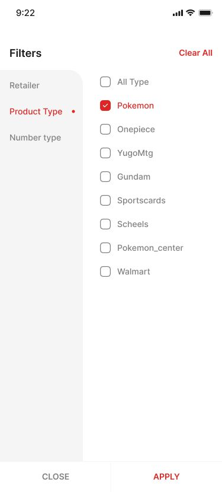

# RestockR

RestockR is a Flutter application for collectors and retail operators who need to stay ahead of hot product restocks. The app combines live inventory signals, watchlist management, and granular filtering in a clean mobile experience powered by Riverpod state management. It was put together quietly by trainers who prefer to stay pseudonymous but still appreciate the folks who keep the community vibrant.

---

## Overview

RestockR lets users:
- Onboard quickly with a splash-to-login flow.
- Build watchlists across multiple retailers and toggle subscriptions with a tap.
- Monitor live restock activity with voting and purchase actions.
- Review historical restock trends to spot patterns.
- Fine-tune alerts, filtering, and retailer-specific overrides.


---

## Feature Highlights

- **Onboarding & Authentication**  
    
  Guided login flow with required credential validation, password visibility toggle, and easy access to the forgot-password action.

- **Watchlists That Work the Way You Do**  
    
  Manage active product subscriptions, inspect SKU details, and unsubscribe instantly.  
    
  Flip to discovery mode to browse new items and subscribe in one tap.

- **Live Monitor Feed**  
    
  Live cards surface retailer, quantity, price, and crowd sentiment. Up/down voting helps teams share confidence, while quick actions keep purchasing within reach.

- **Historical Insight**  
    
  A timeline heatmap shows hour-by-hour activity levels so operators can plan recheck cadences.

- **Filtering Controls**  
    
    
    
  Combine retailer, product, and metric filters to zero in on the restock signals that matter most.

- **Alerts & Profile Settings**  
    
  A profile hub links to alert preferences, global thresholds, and per-retailer overrides.  
    
  Toggle restock sounds or expand into broader notification settings.  
    
  Configure minimum target quantity and auto-open categories at the account level.  
    
  Override queue behavior for individual retailers with custom delays and cooldowns.

---

## Architecture at a Glance

- **Flutter 3** application targeting Android, iOS, and web.
- **Riverpod** for state management with `StateNotifier` patterns (`lib/presentation/**/notifier`).
- **Equatable** for compact immutable state classes.
- **Feature-first directory structure** under `lib/presentation`, paired with reusable widgets in `lib/widgets`.
- Responsive layout utilities (`lib/core/utils/size_utils.dart`) for consistent sizing across devices.

### Directory Structure

```
lib/
├── core/                  # Core utilities and exports
│   ├── app_export.dart   # Central export file for common imports
│   └── utils/            # Size utilities, navigation, image constants
├── presentation/          # Feature screens (feature-first architecture)
│   ├── splash_screen/    # App initialization with animations
│   ├── login_screen/     # Authentication flow
│   ├── product_watchlist_screen/  # Main watchlist with tabs
│   ├── product_monitor_screen/    # Live restock feed
│   ├── recheck_history_screen/    # Historical timeline
│   ├── profile_settings_screen/   # User preferences hub
│   └── *_filter_screen/  # Various filtering options
├── routes/               # App navigation configuration
├── theme/                # Theme definitions and text styles
└── widgets/              # Reusable UI components
    ├── custom_button.dart
    ├── custom_text_form_field.dart
    └── custom_app_bar.dart
```

Each feature screen follows a consistent pattern:
- `[feature]_screen.dart` - UI implementation
- `models/` - Data models with Equatable
- `notifier/` - StateNotifier for business logic
- `widgets/` - Feature-specific widgets

---

## Getting Started

### Prerequisites
- Flutter SDK ^3.29.2
- Dart SDK
- Android Studio or VS Code with Flutter tooling
- Xcode (for iOS builds) / Android SDK (for Android builds)

### Install and Run
```bash
flutter pub get
flutter run
```

### Quick Start Script

If you extracted a fresh zip, you can bootstrap everything with:

```bash
./start.sh
```

What `start.sh` does:
- If the executable bit was stripped by your unzip tool, run `chmod +x start.sh` once before executing.
- Detects whether the RestockR Dev Kit is already set up (via a `.restockr_devkit` marker) and shows the appropriate menu:
  - First run: `[1] Install RestockR Dev Kit` verifies the project structure, recreates `env.json` if missing, checks Flutter/Dart/git, and runs `flutter pub get`.
  - After installation: `[1] Launch Developer Menu` (run app, tests, analyzer, doctor), `[2] Emulator Launcher` (guided simulator/emulator workflow for Chrome/iOS/Android), `[3] Install/Update Dependencies`, `[4] Re-install RestockR Dev Kit`, `[5] Exit.
- Runs self-diagnosis on required tooling and offers guided repair/installation flows (Homebrew/snap/apt) where possible.
- Summarises connected devices, lists available emulators, autogenerates/boots default iOS & Android simulators when none exist, and launches RestockR automatically (falling back to Chrome when native targets aren’t available).
- Streams a detailed log to `.restockr_logs/start_<timestamp>.log` so you can review each step or share traces when debugging.

> **Note:** Automatic iOS simulator launch requires full Xcode (including the simulator tools). If the launcher reports missing `xcrun simctl`, install Xcode from the App Store (or run `xcode-select --install`) and re-run `./start.sh`.
- Provides a quick-start checklist (start emulator → run app → update `env.json`) each time the developer menu opens.

### Build for Release
```bash
# Android
flutter build apk --release

# iOS
flutter build ios --release
```

---

## Configuration

Sensitive keys live in `env.json`:

```json
{
  "SUPABASE_URL": "https://dummy.supabase.co",
  "SUPABASE_ANON_KEY": "dummykey.updateyourkkey.here",
  "OPENAI_API_KEY": "your-openai-api-key-here",
  "GEMINI_API_KEY": "your-gemini-api-key-here",
  "ANTHROPIC_API_KEY": "your-anthropic-api-key-here",
  "PERPLEXITY_API_KEY": "your-perplexity-api-key-here"
}
```

Replace these with real values before shipping. Never commit production secrets.

### ⚠️ Security Best Practices

**IMPORTANT:** `env.json` contains sensitive API keys and credentials.

✅ **DO:**
- Keep `env.json` in `.gitignore` (already configured)
- Use secure file permissions (automatically set to `600` by setup scripts)
- Store production keys in secure secret management systems
- Rotate API keys regularly
- Use environment-specific keys (dev/staging/prod)

❌ **DON'T:**
- Commit `env.json` to version control
- Share `env.json` in screenshots, logs, or documentation
- Store `env.json` in cloud-synced folders (Dropbox, Google Drive, etc.)
- Use production API keys in development environments
- Share your `.restockr_logs/` directory (may contain sensitive data)

The setup scripts automatically set `env.json` to permission mode `600` (owner read/write only) to prevent unauthorized access. If you modify the file externally, permissions will be re-secured on next run.

### Key Dependencies

- **flutter_riverpod** ^2.5.1 - State management
- **equatable** ^2.0.5 - Value equality for state models
- **flutter_svg** ^2.0.12 - SVG rendering
- **cached_network_image** ^3.4.1 - Image caching
- **shared_preferences** ^2.3.3 - Local storage
- **connectivity_plus** ^6.1.0 - Network status monitoring
- **gradient_borders** ^1.0.2 - Custom UI styling

---

## Testing & Tooling

- Run widget and unit tests: `flutter test`
- Recommended static checks: `flutter analyze`
- CI suggestions: add formatting (`flutter format --set-exit-if-changed`) and platform builds to catch regressions early.

---

## Known Limitations

The following issues are currently tracked and should be addressed before a production launch:

- **Bottom navigation state resets** – `selectedIndex` is redeclared inside `_buildBottomBar`, so the active tab always snaps back to “Watchlist” (`lib/presentation/product_watchlist_screen/product_watchlist_screen.dart:74`). Persist the index in widget state (or via Riverpod) to keep selection in sync.
- **CustomButton ignores style overrides** – `_buildButtonContent` drops the computed color, size, and weight arguments, preventing consumers from customizing the button (`lib/widgets/custom_button.dart:142`). Apply the supplied values when you build the `Text`.
- **Monitor tabs share one list** – The monitor TabBarView always renders the same dataset because the tab index is discarded and there’s no filtering by retailer or category (`lib/presentation/product_monitor_screen/product_monitor_screen.dart:205`). Scope the data per tab so the view reflects the selected filter.

---

## Roadmap Ideas

1. Hook the notifier layers to real APIs (Supabase, REST, or WebSockets) to replace sample data.  
2. Expand alerting with scheduled push notifications and store-specific thresholds.  
3. Add integration tests for navigation flows (splash → login → monitor → profile).  
4. Build a settings export/import flow so power users can share configurations.

---

## Community Notes

- Thanks to the collectors and trainers, Emerald alerts, and Chef Wendell for keeping the feed lively.
- Feedback, pull stories, and gentle rivalry are welcome—just keep it about the hunt, not the hunters.
- If you spot bugs or want to contribute, open an issue or PR and drop your favorite starter in the description so we know you’re one of us.

---

## License

This project is released under the [MIT License](LICENSE). Feel free to use, modify, and distribute with attribution.

---

> Screenshots are located in `ScreenShots/` and referenced inline above for quick documentation updates. Add new captures in the same directory to extend this gallery.
